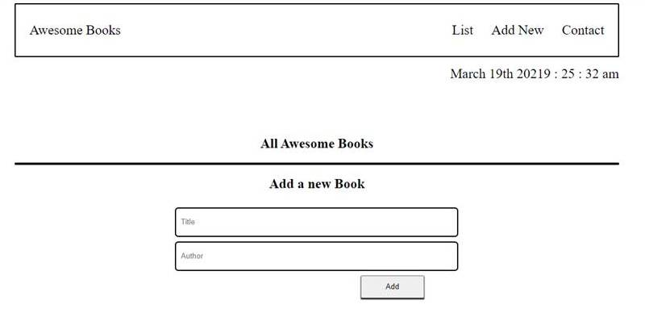

# Awesome Books

> A Microverse project on learnong javascript.

Additional description about the project and its features.

## Built With

- HTML5
- CSS3
- Javascript

## Live Demo

[Live Demo Link](https://billionsjoel/awesome-books-app-es6/)

## Getting Started

To get a local copy up and running follow these simple example steps.
  - Clone the repository using the repo link [here](https://github.com/billionsjoel/awesome-books-app-es6.git)
  - Open terminal and navigate to the downloaded / project folder
  - run npm install
  - run npm install live-server.
  - run live-server

To get a local copy up and running follow these simple example steps.

## Authors

👤 **Authors**

  ## Author1

👤 **Billions Atugonza joel**

- GitHub: [@billionsjoel](https://github.com/billionsjoel)
- Twitter: [@billionsjoel](https://twitter.com/BillionsJoel)
- LinkedIn: [@billionsjoel](https://www.linkedin.com/in/billionsjoel/)

## Author2
👤 **Nuri Lacka**

- GitHub: [@Nuri1977](https://github.com/Nuri1977)
- Twitter: [@Lackanuri](https://twitter.com/LackaNuri)
- LinkedIn: [@nurilacka](https://www.linkedin.com/in/nuri-lacka-7141b01ba/)

## Author3
👤 **Islam Bahnas**
- GitHub: [@Banstein](https://github.com/Banstein)
- Twitter: [@islam_bahnas](https://twitter.com/islam_bahnas)
- LinkedIn: [islam-bahnas](www.linkedin.com/in/islam-bahnas)

## 🤝 Contributing

Contributions, issues, and feature requests are welcome!

Feel free to check the [issues page](../../issues/).

## Show your support

Give a ⭐️ if you like this project!

## Acknowledgments

- Hat tip to anyone whose code was used
- Inspiration
- etc

## 📝 License

This project is [MIT](./MIT.md) licensed.